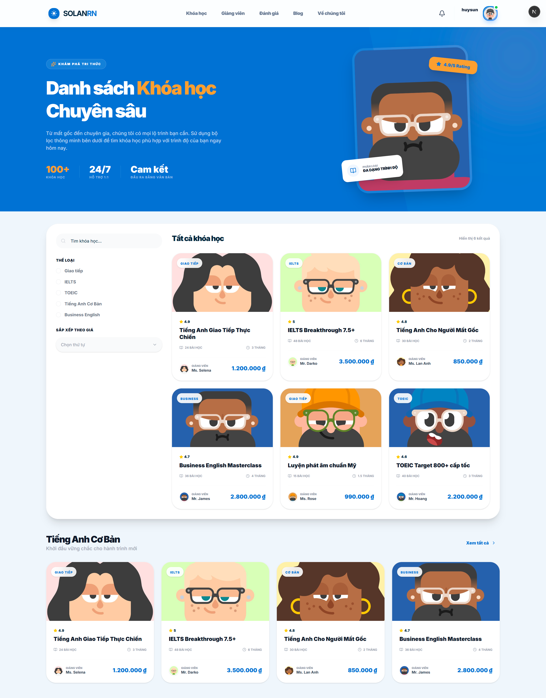
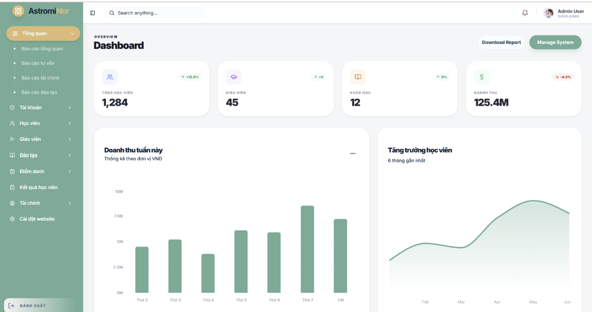
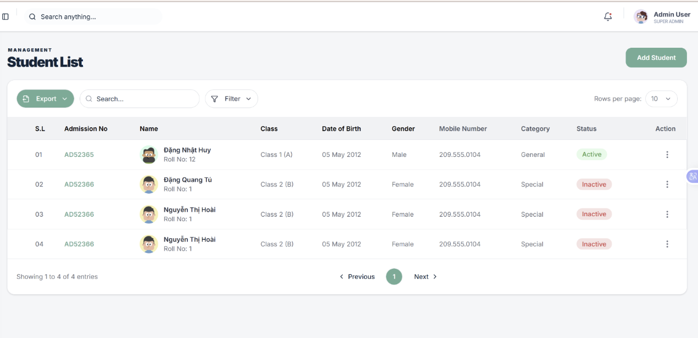
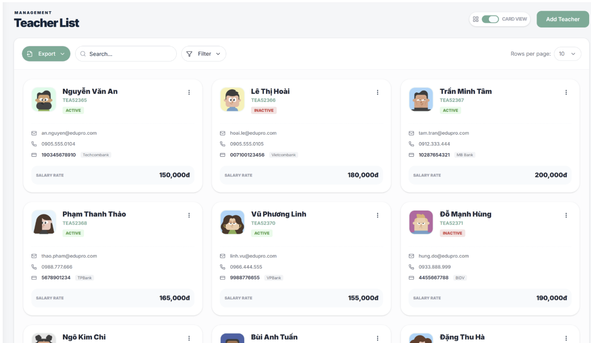
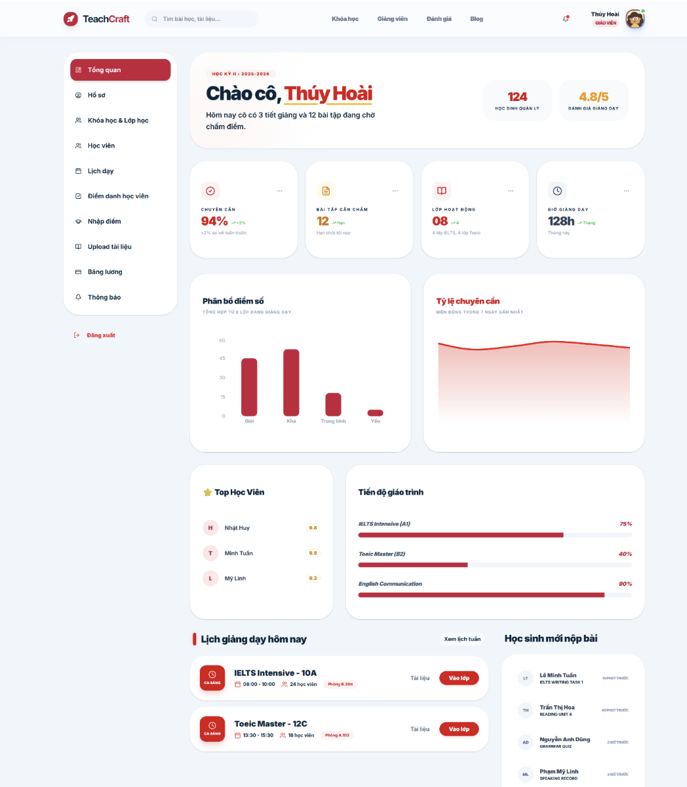
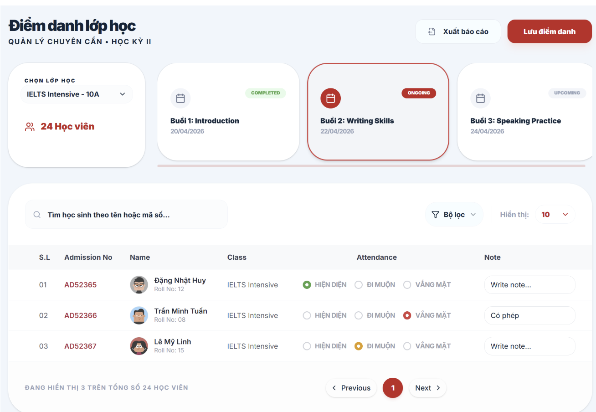
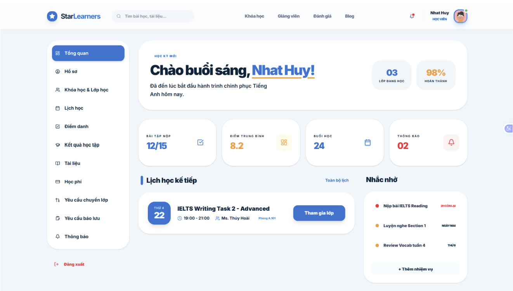
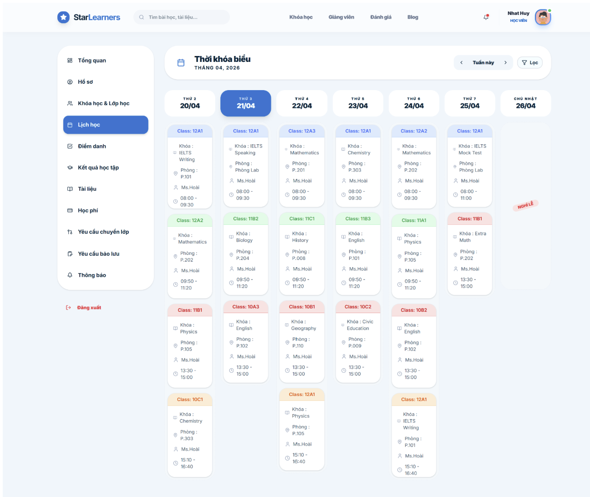

<div align="center">

# 🌞 SOLARN

### *Hệ thống Quản lý Trung tâm Anh ngữ*

[](https://nextjs.org/)
[](https://reactjs.org/)
[](https://www.typescriptlang.org/)
[](https://tailwindcss.com/)

SOLARN là hệ thống quản lý trung tâm Anh ngữ trực tuyến, được xây dựng nhằm hỗ trợ vận hành toàn bộ hoạt động của một trung tâm ngoại ngữ trên nền tảng web. Hệ thống phục vụ ba nhóm người dùng chính: quản trị viên (admin), giáo viên và học viên, với các quyền hạn và chức năng riêng biệt phù hợp với từng vai trò.

</div>

<div align="center">

</div>

---

## 📋 Mục lục

- [✨ Tính năng](#-tính-năng)
- [🛠️ Công nghệ sử dụng](#️-công-nghệ-sử-dụng)
- [📁 Cấu trúc dự án](#-cấu-trúc-dự-án)
- [🚀 Cài đặt & Chạy dự án](#-cài-đặt--chạy-dự-án)
- [⚙️ Biến môi trường](#️-biến-môi-trường)
- [📄 Các trang chính](#-các-trang-chính)
- [🔐 Xác thực & Phân quyền](#-xác-thực--phân-quyền)

---

## ✨ Tính năng

- 👨‍🏫 **Quản lý lớp học** – Tạo và quản lý lớp học, xếp lịch, theo dõi tiến độ
- 📚 **Quản lý khóa học** – Xây dựng chương trình đào tạo, phân bổ giáo viên, tài nguyên
- 👥 **Quản lý học viên** – Theo dõi hồ sơ, điểm danh, kết quả bài tập, chuyển lớp
- 🧑‍🏫 **Quản lý giáo viên** – Thông tin giảng dạy, lương thưởng, đánh giá
- 💰 **Quản lý tài chính** – Học phí, hóa đơn, lương giáo viên, thống kê doanh thu
- 📝 **Điểm danh & Bài tập** – Điểm danh buổi học, giao bài tập, chấm điểm
- 📊 **Dashboard thông minh** – Biểu đồ, thống kê trực quan cho từng vai trò
- 🔔 **Quản lý yêu cầu** – Xử lý đơn xin nghỉ, chuyển lớp, khiếu nại lương
- 📋 **Đánh giá & Phản hồi** – Học viên đánh giá khóa học, giáo viên

---

## 🛠️ Công nghệ sử dụng

| Công nghệ | Phiên bản | Mô tả |
|---|---|---|
| [Next.js](https://nextjs.org/) | 16 | Framework React với App Router |
| [React](https://reactjs.org/) | 19 | UI Library |
| [TypeScript](https://www.typescriptlang.org/) | 5 | Type-safe JavaScript |
| [TailwindCSS](https://tailwindcss.com/) | 4 | Utility-first CSS framework |
| [TanStack Query](https://tanstack.com/query) | 5 | Server state & caching |
| [Zustand](https://zustand-demo.pmnd.rs/) | 5 | Lightweight state management |
| [Axios](https://axios-http.com/) | 1 | HTTP client |
| [React Hook Form](https://react-hook-form.com/) | 7 | Form management |
| [Zod](https://zod.dev/) | 4 | Schema validation |
| [Framer Motion](https://www.framer.com/motion/) | 12 | Animations |
| [Recharts](https://recharts.org/) | 3 | Biểu đồ dữ liệu |
| [TinyMCE React](https://www.tiny.cloud/) | 6 | Rich text editor |
| [TanStack Table](https://tanstack.com/table) | 8 | Bảng dữ liệu |
| [Radix UI](https://www.radix-ui.com/) | - | UI primitives |
| [Sonner](https://sonner.emilkowal.ski/) | 2 | Thông báo toast |
| [Lucide React](https://lucide.dev/) | 1 | Icons |
| [date-fns](https://date-fns.org/) | 4 | Xử lý ngày tháng |

---

## 📁 Cấu trúc dự án

```
solarn_fe/
├── public/                    # Static assets (images, favicon)
├── src/
│   ├── app/                   # Next.js App Router
│   │   ├── (client)/          # Giao diện công khai
│   │   │   ├── (home)/        # Trang chủ
│   │   │   ├── about/         # Giới thiệu
│   │   │   ├── blog/          # Tin tức
│   │   │   ├── course/        # Khóa học
│   │   │   ├── feedback/      # Đánh giá
│   │   │   └── teacher/       # Danh sách giáo viên
│   │   ├── admin/             # Bảng quản trị (25+ modules)
│   │   ├── auth/              # Xác thực (login, register, verify-email)
│   │   ├── student/           # Cổng học viên (14 modules)
│   │   ├── teacher/           # Cổng giáo viên (9 modules)
│   │   ├── demo/              # Trang demo
│   │   ├── layout.tsx         # Root layout
│   │   ├── not-found.tsx      # Trang 404
│   │   └── globals.css        # Global styles
│   ├── components/
│   │   ├── admin/             # Components cho admin
│   │   ├── client/            # Components cho client
│   │   ├── common/            # Components dùng chung
│   │   ├── provider/          # Context / Provider
│   │   └── ui/                # Shadcn/ui components
│   ├── constants/             # Hằng số, enum, filter options
│   ├── hooks/                 # Custom React hooks
│   ├── lib/                   # Utility functions
│   ├── queries/               # TanStack Query hooks
│   ├── schemas/               # Zod validation schemas
│   ├── services/              # API service classes
│   ├── stores/                # Zustand store
│   ├── types/                 # TypeScript type definitions
│   ├── utils/                 # Utilities (axios, token, ...)
│   └── middleware.ts          # Next.js middleware (auth guard)
├── .env                       # Biến môi trường
├── next.config.ts             # Cấu hình Next.js
├── package.json
└── tsconfig.json
```

---

## 🚀 Cài đặt & Chạy dự án

### Yêu cầu hệ thống

- **Node.js** >= 18.x
- **npm** >= 9.x hoặc **yarn** >= 1.22.x

### Bước 1: Clone dự án

```bash
git clone <url-dự-an>
cd solarn_fe
```

### Bước 2: Cài đặt dependencies

```bash
npm install
```

### Bước 3: Cấu hình biến môi trường

Tạo file `.env` tại thư mục gốc:

```bash
cp .env.example .env
```

Sau đó cập nhật các giá trị trong file `.env` (xem phần [Biến môi trường](#️-biến-môi-trường)).

### Bước 4: Chạy môi trường phát triển

```bash
npm run dev
```

Ứng dụng sẽ chạy tại: **http://localhost:3000**

### Build cho Production

```bash
npm run build
npm run start
```

### Lint code

```bash
npm run lint
```

---

## ⚙️ Biến môi trường

```env
# URL API của backend
NEXT_PUBLIC_API_URL=http://localhost:4000/api/v1

# Secret key để xác thực JWT (dùng trong middleware)
ACCESS_TOKEN_SECRET=your_secret_key_here

# API Key của TinyMCE (rich text editor)
NEXT_PUBLIC_TINYMCE_KEY=your_tinymce_api_key_here
```

| Biến | Mô tả | Ví dụ |
|---|---|---|
| `NEXT_PUBLIC_API_URL` | Base URL của REST API backend | `http://localhost:4000/api/v1` |
| `ACCESS_TOKEN_SECRET` | Secret key dùng để verify JWT trong middleware | `your_secret_key` |
| `NEXT_PUBLIC_TINYMCE_KEY` | API Key từ TinyMCE Cloud | `rz50e29x...` |

> **Lưu ý:** Các biến có tiền tố `NEXT_PUBLIC_` sẽ được expose ra phía client. Không đặt thông tin nhạy cảm vào các biến này.

---

## 📄 Các trang chính

### Client

| Route | Mô tả | Yêu cầu đăng nhập |
|---|---|---|
| `/` | Trang chủ | ❌ |
| `/course` | Danh sách khóa học | ❌ |
| `/course/[id]` | Chi tiết khóa học | ❌ |
| `/blog` | Tin tức | ❌ |
| `/blog/[id]` | Chi tiết tin tức | ❌ |
| `/about` | Giới thiệu | ❌ |
| `/feedback` | Đánh giá từ học viên | ❌ |
| `/teacher` | Đội ngũ giáo viên | ❌ |

### Xác thực

| Route | Mô tả | Yêu cầu đăng nhập |
|---|---|---|
| `/auth/login` | Đăng nhập | ❌ |
| `/auth/register` | Đăng ký tài khoản | ❌ |
| `/auth/verify-email` | Xác thực email | ❌ |

---

### 👑 Admin – Bảng quản trị trung tâm

Bảng quản trị dành cho quản lý trung tâm với hơn 25 module, bao gồm:

| Route | Mô tả |
|---|---|
| `/admin/dashboard` | Dashboard tổng quan, tài chính, giám sát, yêu cầu, đào tạo |
| `/admin/account` | Quản lý tài khoản người dùng |
| `/admin/assignment-result` | Quản lý kết quả bài tập của học viên |
| `/admin/attendance` | Quản lý điểm danh các buổi học |
| `/admin/blog` | Quản lý tin tức, bài viết |
| `/admin/branch` | Quản lý chi nhánh / cơ sở |
| `/admin/class` | Quản lý lớp học (tạo lớp, xem chi tiết, lịch học, học viên) |
| `/admin/course` | Quản lý khóa học, chương trình đào tạo |
| `/admin/course-resource` | Quản lý tài liệu, giáo trình khóa học |
| `/admin/enrollment` | Quản lý đăng ký ghi danh |
| `/admin/feedback` | Xem đánh giá, phản hồi từ học viên |
| `/admin/invoice` | Quản lý hóa đơn học phí |
| `/admin/leave` | Quản lý đơn xin nghỉ của học viên / giáo viên |
| `/admin/re-enrollment` | Quản lý tái ghi danh |
| `/admin/role` | Phân quyền người dùng |
| `/admin/room` | Quản lý phòng học |
| `/admin/salary` | Quản lý lương giáo viên |
| `/admin/salary-complaint` | Xử lý khiếu nại lương |
| `/admin/schedule-change` | Quản lý yêu cầu thay đổi lịch học |
| `/admin/schedule-session` | Quản lý lịch học các buổi |
| `/admin/schedule-template` | Quản lý mẫu lịch học |
| `/admin/security` | Cài đặt bảo mật |
| `/admin/setting` | Cấu hình chung website |
| `/admin/student` | Quản lý hồ sơ học viên |
| `/admin/study-shift` | Quản lý ca học |
| `/admin/teacher` | Quản lý hồ sơ giáo viên |
| `/admin/transfer` | Quản lý chuyển lớp |

Các chức năng chính của trang Admin:

- **Quản lý lớp học** – Tạo lớp mới, xếp lịch học, phân công giáo viên, theo dõi sĩ số và tiến độ. Xem chi tiết từng lớp bao gồm lịch học, danh sách học viên, yêu cầu và đánh giá.
- **Quản lý khóa học** – Xây dựng chương trình đào tạo, gắn tài liệu học tập, phân bổ giáo viên giảng dạy cho từng khóa.
- **Quản lý học viên & giáo viên** – Xem và cập nhật hồ sơ, theo dõi lịch sử học tập / giảng dạy.
- **Quản lý tài chính** – Theo dõi học phí, tạo hóa đơn, quản lý lương giáo viên và xử lý khiếu nại.
- **Điểm danh & Bài tập** – Theo dõi tình trạng điểm danh các buổi học, quản lý bài tập và kết quả của học viên.
- **Dashboard & Báo cáo** – Nhiều dashboard trực quan: tổng quan, tài chính, giám sát hoạt động, xử lý yêu cầu và đào tạo.
- **Xử lý yêu cầu** – Tiếp nhận và xử lý các đơn xin nghỉ học, chuyển lớp, thay đổi lịch học và khiếu nại lương.
- **Cấu hình hệ thống** – Thiết lập thông tin chung, bảo mật, phân quyền tài khoản.


<table align="center" width="100%" style="border-collapse: collapse;">
  <tr>
    <td align="center" width="50%" style="border: none; padding: 10px;">
      
      <br>Trang admin
    </td>
    <td align="center" width="50%" style="border: none; padding: 10px;">
      
      <br>Quản lý học viên
    </td>
  </tr>
  <tr>
    <td align="center" width="50%" style="border: none; padding: 10px;">
      
      <br>Quản lý giáo viên
    </td>
    <td align="center" width="50%" style="border: none; padding: 10px;">
      
      <br>Quản lý khóa học
    </td>
  </tr>
</table>

### 🧑‍🏫 Giáo viên – Cổng thông tin giảng dạy

Giáo viên có trang riêng để quản lý công việc giảng dạy hàng ngày:

| Route | Mô tả |
|---|---|
| `/teacher/dashboard` | Dashboard cá nhân, tổng quan lịch dạy |
| `/teacher/assignment-result` | Kết quả bài tập của học viên |
| `/teacher/attendance` | Điểm danh buổi học |
| `/teacher/course-resource` | Tài liệu khóa học |
| `/teacher/feedback` | Xem đánh giá từ học viên |
| `/teacher/salary` | Theo dõi lương và khiếu nại |
| `/teacher/schedule-session` | Xem lịch dạy, gửi yêu cầu thay đổi lịch |
| `/teacher/security` | Cài đặt bảo mật tài khoản |
| `/teacher/student` | Danh sách học viên, theo dõi tiến độ |

Các chức năng chính của trang Giáo viên:

- **Dashboard cá nhân** – Xem tổng quan lịch dạy, thông báo, thống kê lớp học.
- **Quản lý lớp & học viên** – Xem danh sách lớp đang dạy, thông tin học viên, theo dõi tiến độ học tập.
- **Điểm danh** – Điểm danh học viên trong buổi học.
- **Bài tập** – Giao bài tập, chấm điểm và theo dõi kết quả của học viên.
- **Tài liệu khóa học** – Xem và tải tài liệu giảng dạy.
- **Lịch dạy** – Xem thời khóa biểu, gửi yêu cầu thay đổi lịch nếu cần.
- **Lương & Khiếu nại** – Theo dõi bảng lương, gửi khiếu nại nếu có sai sót.
- **Đánh giá** – Xem phản hồi từ học viên về chất lượng giảng dạy.

<div align="center">

<br>Trang giáo viên
</div>

<br>
<div align="center">

<br>Điểm danh học viên
</div>
---

### 🎓 Học viên – Cổng thông tin học tập

Học viên có trang riêng để theo dõi việc học của mình:

| Route | Mô tả |
|---|---|
| `/student/dashboard` | Dashboard cá nhân |
| `/student/assignment-result` | Kết quả bài tập |
| `/student/attendance` | Lịch sử điểm danh |
| `/student/course-resource` | Tài liệu khóa học |
| `/student/enrollment` | Đăng ký khóa học |
| `/student/feedback` | Gửi đánh giá khóa học |
| `/student/invoice` | Hóa đơn học phí |
| `/student/leave` | Gửi đơn xin nghỉ học |
| `/student/profile` | Hồ sơ cá nhân |
| `/student/schedule` | Thời khóa biểu |
| `/student/schedule-session` | Lịch học các buổi |
| `/student/security` | Cài đặt bảo mật |
| `/student/transfer` | Đăng ký chuyển lớp |

Các chức năng chính của trang Học viên:

- **Dashboard cá nhân** – Xem tổng quan khóa học, lịch học sắp tới, thông báo.
- **Thời khóa biểu** – Xem lịch học chi tiết theo tuần.
- **Điểm danh** – Xem lịch sử điểm danh, biết được số buổi đã tham gia.
- **Bài tập** – Xem bài tập được giao, nộp bài và xem kết quả.
- **Tài liệu học tập** – Truy cập tài liệu, giáo trình của khóa học.
- **Học phí & Hóa đơn** – Xem hóa đơn đã thanh toán, theo dõi tình trạng học phí.
- **Đánh giá khóa học** – Gửi phản hồi, đánh giá về khóa học và giáo viên.
- **Đơn từ** – Gửi đơn xin nghỉ học, đăng ký chuyển lớp khi cần.
- **Hồ sơ cá nhân** – Cập nhật thông tin cá nhân, cài đặt bảo mật.

<div align="center">

<br>Dashboard học viên
</div>

<br>
<div align="center">

<br>Thời khóa biểu học viên
</div>
---

## 🔐 Xác thực & Phân quyền

Dự án sử dụng **JWT (JSON Web Token)** lưu trong cookie (`accessToken`) để xác thực người dùng.

### Luồng xác thực (Middleware)

```
Request đến
    │
    ├─ Trang Auth (Login/Register) + Có token hợp lệ → Redirect về trang chủ
    │
    ├─ Trang Public (/, /course, /blog, ...) → Cho qua
    │
    ├─ Trang cần đăng nhập (/student, /teacher) + Không có token → Redirect về "/auth/login"
    │
    ├─ Trang Admin (/admin) + Không có token → Redirect về "/auth/login"
    │
    ├─ Trang Admin (/admin) + Có token nhưng không phải ADMIN → Redirect về trang chủ
    │
    ├─ Trang Giáo viên (/teacher) + Có token nhưng không phải TEACHER → Redirect về trang chủ
    │
    ├─ Trang Học viên (/student) + Có token nhưng không phải STUDENT → Redirect về trang chủ
    │
    └─ Có token nhưng hết hạn → Xóa cookie + Redirect về "/auth/login"
```

### Phân quyền

- **Guest** – Xem trang chủ, khóa học, tin tức, giới thiệu, đánh giá
- **Student** – Tất cả tính năng Guest + truy cập cổng học viên `/student`
- **Teacher** – Truy cập cổng giáo viên `/teacher` với các chức năng giảng dạy
- **Admin** – Toàn quyền + truy cập bảng quản trị `/admin` (25+ modules)

---

<br>
<div align="center">

Made by **SOLARN Team**

</div>
